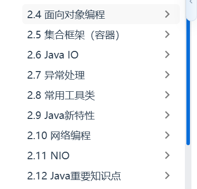
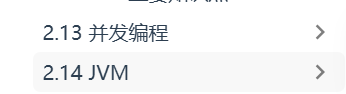

# 📅 每日打卡 | 2026-04-29
> 节奏：工作日1h加练
⏳ 距离今年结束： 246  天

⏰ 学习开始：21:44
⏰ 学习结束：23:30
---

## 💼 今日工作亮点（核心重点）
> 上班解决的问题、学到的技术，直接变成面试项目话术
- **解决的问题**：日常crud项目、导数据完善通用模块
- **学到的技术点**：加深crud项目流程
- **可沉淀内容**：整合之前的项目难点

---

## ✅ 今日加练（碎片化学习）
- **后端**：学习构造函数，抽象类，权限修饰符等

---

## ❓ 遗留盲区（查缺补漏）
> 预计4周内完成，顺利的话
-  
> 1-2周将重要的概念过一遍 
- 
- 补一下git吧

---

## 🎯 明日计划（一句话收尾）
- 后端：6周内将java内容过个80%
- 前端：未来希望花1-2周补一下基础，以及做一个思维导图画板项目
- 补盲区：利用cv大法找一个适合自己的项目部署线上
