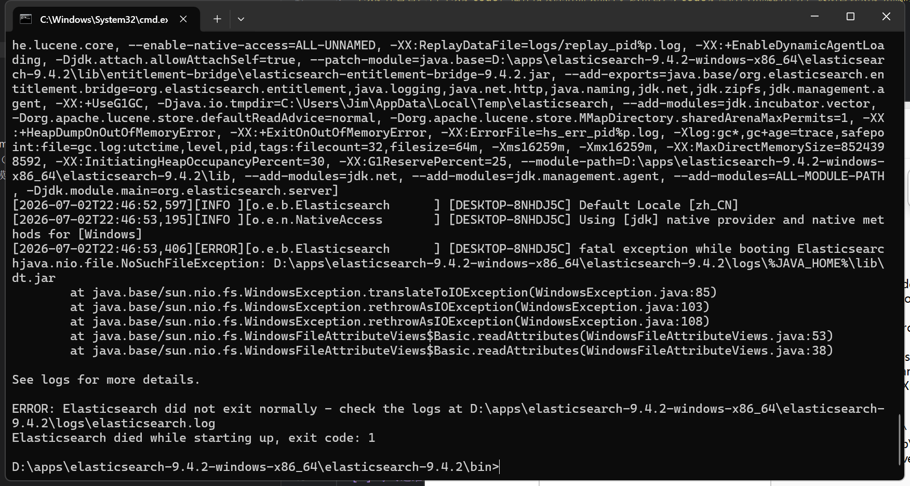

# 📅 每日打卡 | 2026-07-02
节奏：工作日加练 

🔥 **本月核心目标**：完成微服务的实用篇学习（剩下elasticSearch）

🔥 **本周目标**：完成微服务的实用篇学习（剩下elasticSearch）

⏳ 距离今年结束：182 天
🧨 距离2027新年春节：219 天

⏰ 学习开始：21:10
⏰ 学习结束：22:48

---

📝 备忘录
> 可以是往日盲区也可以是todo，推荐按实际情况填顺序。遗留盲区/todo是短时间完成的任务，长期目标则是完成时间长的任务。
- ### 🔴 遗留盲区/todo
- [ ] 完成2026-07-02的遗留盲区
- [ ] 完成2026-06-25的遗留盲区
- [ ] docker没学习透彻，后期买了linux服务器可以继续学习（特别是微服务集群这方向）
- [ ] 多了解agent的更多用法（包括压测等其他方面），最好写一篇文章
- [ ] 将感兴趣的公司都关注微信公众号，了解公司动态和技术动态

### 🟡 长期目标
- [ ] 制定英语学习方向
- [ ] 封装通用微服务后台管理系统，并部署github
- [ ] 完善一个类ERP后台管理系统（包含供应链、仓库、物流、订单、采购、库存等模块,应该可以合并上述项目），并部署github
- [ ] 完善目前的物联网后台管理系统，并部署github
- [ ] 基于上述后台完善一个小程序（一定要有支付）
- [ ] 基于上述后台完善一个前台（体现性能优化）
- [ ] 学习ai编程工具的使用（主要是学习agent的使用和其他高阶用法）
- [ ] 完成agent的应用开发
- [ ] 完成ai应用开发（关于ai可以参考鱼皮和小林coding后制定学习路线）
- [ ] 学习spring-cloud高级篇
- [ ] 刷git
- [ ] 刷性能优化
- [ ] 刷算法
- [ ] 刷其他编程基础
- [ ] 上述每完成一个可以更新简历
- [ ] 学习前端3d？
- [ ] 完成上述事项，可以考虑通过浏览器的稍后在看和工作经验的文章查缺补漏写文章
- [ ] 学习python?
- [ ] 学习go？
- [ ] 学习运维？
- [ ] 参与github其他大型项目的开发
- [ ] 其他能力学习（沟通能力、情商、人情世故、演讲能力、逻辑思维能力
- [ ] 将语雀的日志/遗留盲区转移到github上，方便以后查找和总结

---

## 🎒 今日工作亮点（核心重点）
> 上班解决的问题、学到的技术，直接变成面试项目话术
- **今日掌握/踩坑技术点**：踩坑记录：总是想着用vxe-table原生表格去实现功能，其实使用渲染器可以更灵活地实现功能
- **业务解决问题**：vxe-table解决大数据量（10万条数据）的展示，
- **封装/沉淀包装思路（简历可用）**：1.在自己的后台管理系统写一个界面，实操一遍vxe-table的功能 2.vxe-table解决了大数据量的表格滚动问题，但是遇到字段多的大数据量还是要分批渲染，这个时候就需要使用requestIdleCallback释放浏览器工作，建议熟记这个写法。

---
## ✅ 今日加练（碎片化学习）
- 加班+学习加练，es启动卡bug（logs里一直找不到java_home应该怎么解决。。。）
  

---
## ❓ 遗留盲区（查缺补漏）
- 用虚拟机搭建一个这样的应用还是服务器好呢？

---
## 🎯 明日计划（一句话收尾）
- 继续学习es

  