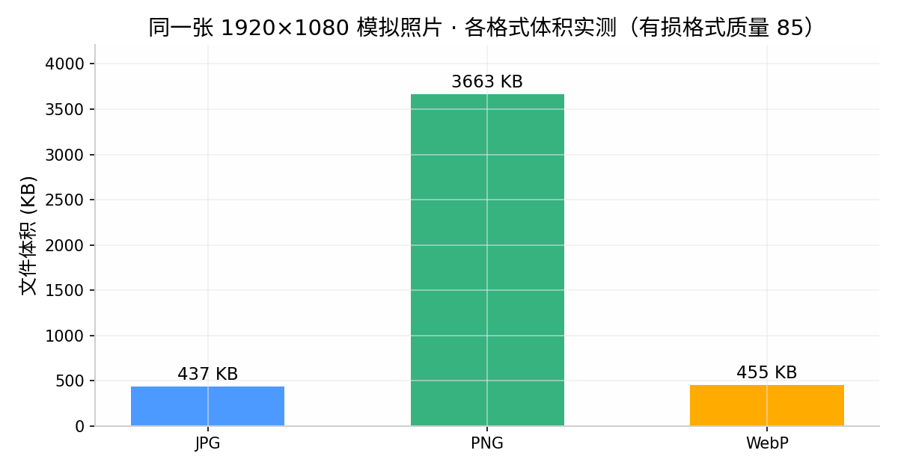

# 吃透 Web 图片：从传输编码到前后端性能优化

> **📌 摘要**：作为全栈开发，图片处理几乎每个项目都会碰到。我在 UniApp 多端上传图片时踩了一堆坑：图片过大超时、EXIF 自动旋转、base64 请求爆炸、WebP 兼容性差。本文不只讲 API 调用，往下挖到传输底层，从前端读取、编码转换，到后端接收存储，完整梳理图片的整套知识。

---

## 一、Web 项目图片传输方式

图片的处理链路有两个方向：**上传**（前端 → 后端）和**拉取**（后端 → 前端渲染）。很多人只关注上传，其实拉取的方案选择同样影响体验。

### 1.1 图片上传

| 方式 | 原理 | 优点 | 缺点 | 适用场景 |
| :--- | :--- | :--- | :--- | :--- |
| **FormData 二进制上传** | `multipart/form-data`，原始字节流分段传输 | 主流方案，服务端原生支持，可流式 | 要处理 multipart 边界，代码略繁琐 | 默认首选 |
| **Base64 上传** | 二进制转 ASCII 文本放 body | 能塞进 JSON / HTML，无需特殊请求头 | **体积膨胀约 33%**，且无法流式处理 | 小图、和 JSON 一起提交 |
| **Blob 分片上传** | 大文件切成多个 Blob 块，多段请求 | 支持断点续传，失败只重传单块，弱网友好 | 实现复杂：分片管理、合并、去重 | 大图、弱网 |

### 1.2 图片拉取

| 方式 | 说明 |
| :--- | :--- |
| **返回 URL** | 存 OSS / 静态资源，前端 `<image>` 直接引用，最常用 |
| **接口返回二进制流** | 需要鉴权下载等场景，注意 `Content-Type` 和 `Content-Disposition` |
| **Base64 内嵌** | 极小图标、验证码，不适合照片 |

**选型口诀**：图片走文件上传（FormData），数据走 JSON；base64 只服务小图；超过 10MB 考虑分片。

---

## 二、图片常见格式与编码类型

这一章解决一个高频误解：**图片格式 ≠ 传输编码**。

### 2.1 文件存储格式（图片本体的压缩格式）

| 格式 | 压缩方式 | 透明度 | 典型用途 |
| :--- | :--- | :--- | :--- |
| JPG | 有损 | ❌ | 照片、大背景图 |
| PNG | 无损 | ✅ | 图标、截图、需透明 |
| WebP | 有损/无损都支持 | ✅ | 兼容允许时的首选 |
| AVIF | 有损，压缩率更高 | ✅ | 新方案，兼容性参差 |
| GIF | 无损（调色板） | ✅ | 动图 |

同一张 1920×1080 画面、有损格式质量统一 85，各格式体积实测对比（PNG 遥遥领先——反向的那种）：



**兼容性矩阵（发布前请按目标平台再验证）**：

| 格式 | 现代浏览器 | 微信小程序 | App 端 |
| :--- | :---: | :---: | :---: |
| JPG / PNG | ✅ | ✅ | ✅ |
| WebP | ✅ | ✅（基础库较新版本） | ✅（部分老机型需验证） |
| AVIF | ✅（新版浏览器） | ⚠️ 支持有限 | ⚠️ 需实测 |


### 2.2 网络传输编码（传输时的“包装”）

- **Blob**：浏览器里的原始二进制对象，上传的载体。
- **ArrayBuffer**：底层二进制容器，FileReader / canvas 操作的中间形态。
- **Base64**：二进制 → ASCII 文本，每 3 字节变 4 字符，**体积膨胀约 33%**，优点是可以内嵌在 JSON / HTML 里。

> 💡 记住：**base64 不是图片格式**，只是一种编码。PNG 图片转成 base64 还是 PNG 数据，只是变大了。
> 打个比方：base64 就像把一箱行李强制打包成“易碎品”——能寄到目的地，但体积凭空大了三分之一，还全程不让拆包（无法流式处理）。

光看概念容易混，把几种“存在形式”摆进一张表里对比最直观：

| 形式 | 可直接显示 | 跨域限制 | 本地预览 | 推荐用途 |
| :--- | :---: | :---: | :---: | :--- |
| 网络 URL | ✅ | 有 | ❌ | 最常见场景 |
| 本地路径 | ✅ | 无 | ✅（需起本地服务器） | 项目资源图 |
| Base64 | ✅ | 无 | ✅ | 小图标、嵌入图 |
| Blob | ✅ | 无 | ✅ | 上传 / 预览 |
| ArrayBuffer | ❌ | 无 | ✅ | 图像底层处理 |

**怎么选**：展示外部图 → URL；项目静态资源 → 本地路径；上传 / 预览 → Blob；处理像素 → ArrayBuffer；小图嵌入 → Base64。

### 2.3 EXIF 元信息

EXIF 里存着拍摄时间、相机参数，还有一个关键字段——**方向（Orientation）**。手机拍照时常把“旋转信息”写进 EXIF 而不是旋转像素本身，这就是“图片上传后自动横过来”的根源。

---

## 三、图片传输底层原理

### 3.1 前端读取：图片在内存里的流转

> 🌟 **重点！先记住这条核心链路，后面所有 API 都只是它的某一段：**
> **用户选择文件（input / file）→ 得到 File 对象（继承自 Blob）→ 用 FileReader / URL API 处理 → 输出 Base64 / Blob / URL 格式 → 用于预览 / 上传**

链路长什么样知道了，接着看链路上跑的到底是什么货。图片本质就是**二进制字节流**——硬盘里躺着一长串 0 和 1，所谓“图片”不过是解码规则还原出来的画面。前端拿到 `File` 对象后，有三条路把它变成能用的数据：

```js
// ① 读成 base64（小图 preview 用）
const reader = new FileReader();
reader.onload = e => { /* e.target.result 就是 base64 */ };
reader.readAsDataURL(file);

// ② 读成 ArrayBuffer（需要操作像素时用）
reader.readAsArrayBuffer(file);

// ③ 直接给 URL（大图展示最省内存）
const url = URL.createObjectURL(file);
// 用完必须释放，否则内存泄漏
URL.revokeObjectURL(url);
```

### 3.2 HTTP 传输层

- **FormData**：按 `multipart/form-data` 协议把文件切成段传输，服务端解析边界取出文件流。
- **Base64**：纯文本放 body，无需特殊请求头，但体积 +33%，大图上等于自己给自己限速。
- **分片上传**：把 Blob 切成 N 块并行 POST，服务端按序号合并，失败只重传单块——这是断点续传的基础。

### 3.3 后端接收：一个容易被忽略的坑——**流式 vs 全量读内存**

```java
@PostMapping("/upload")
public Result upload(@RequestParam("file") MultipartFile file) throws IOException {
    // ① 校验大小和类型（先校验，再读写）
    if (file.getSize() > 10 * 1024 * 1024) {
        return Result.fail("图片不能超过 10MB");
    }
    String contentType = file.getContentType();
    if (!Set.of("image/jpeg", "image/png", "image/webp").contains(contentType)) {
        return Result.fail("不支持的图片类型");
    }
    // ② 转存 OSS，不要长期落服务器磁盘
    String url = ossService.upload(file.getInputStream(), contentType);
    return Result.ok(url);
}
```

```java
// Base64 接收：图片以文本形式塞在 JSON body 里
@PostMapping("/upload-base64")
public Result uploadBase64(@RequestBody Map<String, String> body) {
    String dataUrl = body.get("image");              // 形如 data:image/png;base64,iVBOR...
    String base64 = dataUrl.substring(dataUrl.indexOf(",") + 1);
    byte[] bytes = Base64.getDecoder().decode(base64);
    if (bytes.length > 100 * 1024) {                 // base64 只配小图
        return Result.fail("base64 只适合 100KB 以内的小图");
    }
    String url = ossService.upload(new ByteArrayInputStream(bytes), "image/png");
    return Result.ok(url);
}
```

```java
// 分片上传接收：前端把 Blob 切成 N 块逐片传，最后通知合并
@PostMapping("/chunk")
public Result uploadChunk(@RequestParam("file") MultipartFile chunk,
                          @RequestParam("uploadId") String uploadId,
                          @RequestParam("index") int index) throws IOException {
    ossService.saveChunk(uploadId, index, chunk.getInputStream()); // 按 uploadId/index 存临时分片
    return Result.ok();
}

@PostMapping("/merge")
public Result merge(@RequestParam("uploadId") String uploadId,
                    @RequestParam("total") int total) {
    String url = ossService.mergeChunks(uploadId, total);          // 按序号拼接并清理临时分片
    return Result.ok(url);
}
```


**② 为什么不直接落服务器磁盘？** 三个绕不开的问题：

1. **又小又贵**：云盘容量按“出租屋”计价，图片却是只增不减的房客；
2. **多实例不共享**：应用部署两份，A 机器存的图 B 机器上就是 404——违背微服务“无状态”的基本原则；
3. **吃不到 CDN**：图片是 CDN 收益最大的静态资源，而 CDN 只认公网 URL，不认你磁盘路径。

**存 MinIO 行不行？** 完全可以。MinIO 就是开源自建的对象存储，协议与 S3 兼容，代码里换掉 endpoint 和密钥即可；学习阶段用 Docker 在本地起一个 MinIO 反而更方便。云 OSS 相当于“云仓”，MinIO 相当于“自家仓库”，存取逻辑是同一套。

**`getInputStream()` 还是 `getBytes()`？一个值得停 10 秒的细节**

前面代码用的是 `file.getInputStream()`，而不是 `file.getBytes()`。差别一句话：**前者是接力，后者是囤货**——`getBytes()` 会把整张图片读进 JVM 堆内存，再转成字节数组体积直接翻倍；`InputStream` 则把数据一棒接一棒交给对象存储，全程不占堆、不落盘。再加上 Spring 解析大文件 multipart 时会先写临时目录，上传一多磁盘同样告急。所以“先校验大小、流式转存”不是仪式感，是保命：

```java
// ❌ 危险写法：全量读进内存，图片越大死得越快
byte[] bytes = file.getBytes();
ossClient.putObject(bucket, key, new ByteArrayInputStream(bytes));

// ✅ 推荐写法：流式直传，像接力赛一样一棒接一棒，中途不囤货
ossClient.putObject(bucket, key, file.getInputStream());
```

光流式还不够，再配两道闸把大文件挡在门外——Spring 限制请求体大小：

```yaml
spring:
  servlet:
    multipart:
      max-file-size: 10MB
      max-request-size: 20MB
```

- 前面若还有 Nginx，别忘了它的 `client_max_body_size`，否则请求根本没到 Java 就被 **413** 挡掉。

### 3.4 静态图片访问

图片存好后，拉取侧靠缓存提速。所谓提速，本质是两件事：**少传**（第二次访问不再下载）和**就近**（CDN 边缘节点直接返回，不必千里迢迢回源站）。

- `Cache-Control: public, max-age=31536000, immutable`：浏览器第一次下载后缓存一年，之后直接用本地副本，**连请求都不发**。只有文件名带 hash（内容变 hash 就变，缓存自动失效）才敢这么激进，否则图片更新了用户看到的还是旧图。
- `ETag` / `Last-Modified`：缓存过期或没命中时，浏览器带着标识问一句“变了没？”，没变服务端回 **304**——只传一个响应头，不传图片本体。


---

## 四、图片性能优化手段

> 💡 这里不包含全部手段，只分享常见的几种。

### 4.1 前端优化（UniApp 重点）

1. **上传前预处理**：`uni.compressImage` 压缩、按业务最大边等比缩放、质量降到 80 左右、PNG 截图类转 WebP。
2. **传输优化**：小图 base64、大图 FormData、超大图分片；并发上传数控制在 3~5 个。
3. **渲染优化**：列表图片懒加载 + 缩略图预览，**永远不要直接加载原图**。
4. **内存优化**：`createObjectURL` 用完全部 `revokeObjectURL`，canvas 用完清空宽高释放像素内存。

上面的**缩略图**值得解释一下：它就是同一张图的小尺寸版本，像菜单上的样品图——列表页一屏几十张图，如果每张都用 5MB 原图，用户看个首屏就要吞下几百 MB。所以列表一律用缩略图，点进详情才看原图。

```js
// 缩略图不用存两份：拉取 OSS 图片时加处理参数（示例为阿里云 OSS，其他厂商语法不同）
const thumbUrl = `${url}?x-oss-process=image/resize,w_300`;
```

```html
<!-- Web 端原生懒加载；UniApp 对应 <image lazy-load> -->

```

### 4.2 后端优化（Java / SpringBoot）

1. **接收层**：大小、类型、魔数（Magic Number，文件头）三重校验，拦截伪装图片。

> 💡 **魔数是什么？** 文件开头几个固定的字节，相当于文件的“暗号”：JPEG 以 `FF D8 FF` 开头，PNG 以 `89 50 4E 47` 开头。`Content-Type` 是客户端自己填的，说假话零成本；而魔数写在文件内容里，改不了。所以后端校验要以魔数为准，类型白名单为辅：

```java
// 魔数校验：读文件头几个字节，对“暗号”
try (InputStream in = file.getInputStream()) {
    byte[] head = new byte[4];
    if (in.read(head) < 4) return Result.fail("文件不完整");
    boolean isJpg = (head[0] & 0xFF) == 0xFF && (head[1] & 0xFF) == 0xD8;
    boolean isPng = (head[0] & 0xFF) == 0x89 && head[1] == 0x50 && head[2] == 0x4E && head[3] == 0x47;
    if (!isJpg && !isPng) return Result.fail("文件内容不是图片，换个后缀也混不进来");
}
```

2. **存储层**：转存对象存储（云 OSS 或自建 MinIO），原图和缩略图分开存，别往应用服务器磁盘里塞。
3. **异步化**：转码、生成缩略图丢 RabbitMQ，**上传接口只负责接和存，秒回响应**（相当于医院叫号：先把活儿挂号排队，后台慢慢办理，前台窗口绝不堵着）。
4. **分发层**：CDN + HTTP 缓存头，图片是 CDN 收益最大的静态资源。
5. **安全层**：上传接口限流，防恶意大文件攻击。

```java
// 上传接口只落库 + 发消息，转码异步做，接口秒回
rabbitTemplate.convertAndSend("image.exchange", "image.transcode", imageId);
```

```java
@RabbitListener(queues = "image.transcode.queue")
public void transcode(Long imageId) {
    // 生成缩略图、转 WebP……慢活都在这，不阻塞上传
}
```

---

## 五、实战落地：UniApp + Java 图片上传

### 5.1 Web 端（Element Plus el-upload）

`el-upload` 默认就是 **multipart/FormData** 上传，组件的 `name="file"` 对应后端 `@RequestParam("file")`。

```vue
<template>
  <el-upload
    action="https://api.example.com/upload"
    :headers="{ Authorization: `Bearer ${token}` }"
    name="file"
    accept="image/jpeg,image/png,image/webp"
    :limit="3"
    :file-size="10"
    :before-upload="beforeUpload"
    :on-success="onSuccess"
    :on-exceed="onExceed">
    <el-button type="primary">点击上传</el-button>
  </el-upload>
</template>

<script setup>
// before-upload：上传前钩子，在这里做校验/压缩；返回 false 或 Promise.reject() 即阻止上传
const beforeUpload = (file) => {
  const ok = ['image/jpeg', 'image/png', 'image/webp'].includes(file.type);
  if (!ok) ElMessage.error('只能上传 JPG / PNG / WebP');
  return ok; // 要压缩就 return 压缩后的 Promise（配合 http-request 接管上传）
};
const onSuccess = (res) => { /* 拿到图片 URL */ };
const onExceed = () => { ElMessage.warning('最多上传 3 张'); };
</script>
```

| 参数 | 作用 | 易错点 |
| :--- | :--- | :--- |
| `action` | 上传地址 | 要完全自定义请求时用 `http-request` 接管 |
| `:headers` | 请求头，通常放 token | 注意过期刷新 |
| `accept` | 文件选择器过滤 | **只是“选文件时的过滤”，不是安全校验**，后端必须再验 |
| `:limit` + `on-exceed` | 最大数量与超限回调 | — |
| `:file-size` | 大小上限，**单位是 MB** | 前端拦截，后端仍要校验 |
| `:before-upload` | 上传前钩子 | 返回 `false` 即阻止上传，压缩逻辑放这 |
| `name` | 文件字段名 | 默认 `file`，要和后端 `@RequestParam` 对上 |

### 5.2 UniApp 端

> 📌 参数先记住一条：`uni.uploadFile` 的 `name` 对应后端 `@RequestParam("file")` 的参数名，传错会直接报 400。

```js
// 选图 + 压缩 + 上传
uni.chooseMedia({
  count: 1,
  mediaType: ['image'],
  success: (res) => {
    const src = res.tempFiles[0].tempFilePath;
    uni.compressImage({
      src,
      quality: 80,
      success: (r) => {
        uni.uploadFile({
          url: 'https://api.example.com/upload',
          filePath: r.tempFilePath,
          name: 'file',
          success: (resp) => { /* 拿到 URL */ }
        });
      }
    });
  }
});
```

| uni.uploadFile 参数 | 作用 |
| :--- | :--- |
| `url` | 上传接口地址 |
| `filePath` | 本地临时文件路径（chooseMedia / compressImage 的产物） |
| `name` | 文件字段名，对应后端 `@RequestParam("file")` |
| `formData` | 顺带提交的其他表单字段 |
| `header` | 请求头（token 等） |
| `timeout` | 超时时间（大图建议调大） |

### 5.3 前后端联调对照

联调时最容易“对不上”的地方在下面这张表：

| 前端方式 | 请求 Content-Type | 后端接法 | 对不上时的典型症状 |
| :--- | :--- | :--- | :--- |
| FormData（el-upload / uploadFile） | `multipart/form-data` | `@RequestParam("file") MultipartFile` | 400：前端 `name` 和后端参数名不一致 |
| Base64 | `application/json` | `@RequestBody` 取字符串再解码 | 500：忘了剥掉 `data:image/...;base64,` 前缀 |
| 分片上传 | 每片一个 `multipart/form-data` 请求 | `/chunk` 收片 + `/merge` 合并 | 合并后文件损坏：分片序号没对齐或丢片 |

> 📌 三个 400/500 我都踩过，排查顺序：先看 `name`，再看 Content-Type，最后看 JSON 里的 base64 是不是完整。

### 5.4 踩坑记录（🔥 我预判你会在这三个坑摔倒）

**坑 1️⃣：图片上传后“自动旋转”了**
现象：手机上竖着拍，上传完横着显示。
原因：相机把方向写进了 EXIF，canvas 重新编码时丢失了这个信息。
解决：压缩/转码前读取 EXIF Orientation，在 canvas 上按角度手动旋转后再导出；或优先用原生压缩能力，少过一次 canvas。

```js
// 思路：先读 EXIF 的 orientation，再按角度在 canvas 上重绘
function drawWithOrientation(ctx, img, orientation, w, h) {
  switch (orientation) {
    case 3: ctx.rotate(Math.PI); ctx.translate(-w, -h); break;
    case 6: ctx.rotate(Math.PI / 2); ctx.translate(0, -w); break;
    case 8: ctx.rotate(-Math.PI / 2); ctx.translate(-h, 0); break;
    default: break;
  }
  ctx.drawImage(img, 0, 0, w, h);
}
// orientation 可用 exif 解析库读取；嫌麻烦就优先用 uni.compressImage 这类原生能力，少过一次 canvas
```

**坑 2️⃣：base64 上传报 413 / 请求超时**
现象：直接把 base64 塞进 JSON 提交，大图必炸。
原因：base64 体积膨胀 33%，再叠加网关 `client_max_body_size`、Tomcat 请求体限制。
解决：图片一律走 `uni.uploadFile`（multipart）；必须 base64 时限制在 100KB 以内，且检查 Nginx 和 Spring 双重上限。

```nginx
# Nginx：请求没到 Java 就被 413 挡掉，就是它
client_max_body_size 20m;
```

```yaml
# Spring：第二道闸
spring:
  servlet:
    multipart:
      max-file-size: 10MB
      max-request-size: 20MB
```

**坑 3️⃣：小程序 canvas 压缩后失真**
现象：压缩完文字模糊、色块断裂。
原因：canvas 按固定宽高重采样，小尺寸 canvas 压缩大图，采样率不足。
解决：canvas 尺寸按“原图边长等比缩放后”计算，别用固定小 canvas 压所有图；质量参数建议 70~85 之间实测取平衡。

```js
// 按最大边等比计算 canvas 尺寸，避免小 canvas 压大图导致采样失真
const MAX_W = 1080;
const scale = Math.min(1, MAX_W / img.width);
canvas.width  = Math.round(img.width * scale);
canvas.height = Math.round(img.height * scale);
ctx.drawImage(img, 0, 0, canvas.width, canvas.height);
const dataUrl = canvas.toDataURL('image/jpeg', 0.8); // 质量在 0.7~0.85 之间实测取值
```

---

## 六、总结

把整条链路再看一遍：

```javascript
图片二进制 → 前端读取/编码/压缩 → HTTP 传输（FormData / Base64 / 分片）
→ 后端校验接收（流式！）→ OSS → CDN + 缓存头分发 → 前端懒加载渲染
```

这个项目让我体会到：图片传输看着简单，实际是**协议、编码、浏览器行为、平台兼容性**的交叉点。把这一链路吃透，以后再遇到上传、下载、预览的任何变形问题，都能快速定位到环节。


> 💬 **提问**：关于图片传输，你踩过最离谱的图片坑是哪一个？

---

