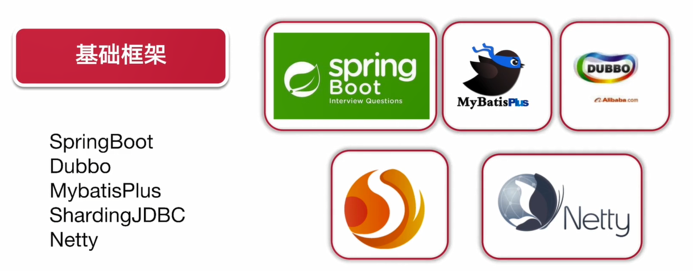
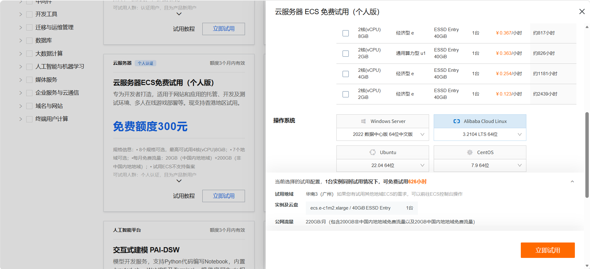

# 🎥 手搓一套直播高并发环境！一个后端小白从 0 到 1 的搭建笔记

> **📌 摘要**：高并发一直是后端面试和实战里的“硬骨头”。我以一个初学者的身份，从架构设计到开发落地，完整手搓了一套直播项目的技术环境。本文记录我的搭建过程、技术选型思路、踩坑记录和学到的知识点。

<p align="center">
<b>技术栈</b><br>
MySQL · Caffeine · Redis · RabbitMQ · Spring Boot · Spring Cloud · Dubbo · MyBatis-Plus · ShardingJDBC · Netty · Vue · Docker · K8s · Nacos
</p>



---

## 1. 项目介绍

### 1.1 我为什么做这个项目

我是一名后端开发。做这个项目有三个朴素的原因：

1. **🚀 高并发是后端的分水岭**。CURD 写久了容易陷入舒适区，而直播场景天然带着“突发流量、长连接、强互动”的属性，是检验后端功底的好战场。
2. **📈 想往高级程序员进阶**。高级开发不只是写业务，更要理解架构：为什么这样拆分服务？为什么这里要加缓存？为什么消息要经过 MQ？我想亲手把这些问题的答案跑一遍。
3. **🧠 好奇心**。从架构设计、编码开发、Docker 部署到后期维护，一个系统完整地“活”在自己手里，这个过程本身就很有吸引力。

**最终效果**：用户访问直播首页 → 拉取直播列表 → 进入直播间看直播 → 聊天 / 送礼 → 退出。背后涉及用户、账户、支付、直播、礼物、IM 六大服务。


### 1.2 业务模块分析

我把系统拆成了 6 个服务，依赖关系如下：

| 服务 | 职责 | 定位 |
| :--- | :--- | :--- |
| 👤 **用户服务** | 登录注册、用户基础信息 | 被所有服务依赖，属“地基” |
| 💰 **账户服务** | 钱包余额管理，送礼扣款 / 收款 | 资金核心 |
| 💳 **支付服务** | 充值相关 | — |
| 🎁 **礼物服务** | 礼物列表、送礼记录 | — |
| 📡 **直播服务** | 直播间管理、推拉流信息 | — |
| 💬 **IM 服务** | 直播间聊天消息 | 依赖用户服务做身份校验 |


可以看到，**用户服务和 IM 服务是依赖的“枢纽”**，这意味着它们是高并发下最需要保护的服务——后面讲限流和降级时会呼应这一点。

### 1.3 技术选型：为什么是这些组件？

| 技术 | 解决的场景 | 我的一句话理解 |
| :--- | :--- | :--- |
| 🐳 Docker + K8s | 环境一致性、服务编排 | “在我机器上能跑”的终结者 |
| 📒 Nacos | 注册中心 + 配置中心 | 服务的“通讯录”和“公告栏” |
| 🌐 Spring Cloud + Dubbo | 微服务治理 + RPC 调用 | 服务之间的“打电话系统” |
| ⚡ Redis | 热点缓存、在线状态、限流计数 | 挡在 MySQL 前面的盾牌 |
| 💨 Caffeine | JVM 内本地缓存 | 比 Redis 更近一层的缓存 |
| 📨 RabbitMQ | 消息削峰、异步解耦 | 直播高峰的“蓄水池” |
| 🔌 Netty | IM 长连接 | 聊天消息的高速公路 |
| 🗂️ ShardingJDBC | 分库分表 | 数据量大了之后的“分家协议” |
| 🛠️ MyBatis-Plus | ORM 提效 | 少写一半重复 SQL |


### 1.4 框架比对：Netflix 还是 Alibaba？

搭环境前我纠结过用 Spring Cloud Netflix 还是 Alibaba 系，整理了一张对照表：

| 能力 | Spring Cloud Netflix | Spring Cloud Alibaba |
| :--- | :---: | :---: |
| 网关 | Zuul | ✅ Gateway |
| 注册中心 | Eureka / Consul / Zookeeper | ✅ Nacos |
| 配置中心 | Spring Cloud Config | ✅ Nacos / Apollo |
| 远程调用 | Feign 为主 | ✅ Dubbo 为主 |
| 熔断 | ❌ Hystrix（已停更） | ✅ Sentinel |
| 链路追踪 | Sleuth + Zipkin | ✅ Skywalking |

**结论很现实**：Hystrix 停更、Zuul 性能一般，Alibaba 系对 Dubbo 和中文文档更友好，所以我选了 **Nacos + Dubbo + Sentinel** 的组合。


---

## 2. 项目搭建步骤

我的搭建顺序遵循“**地基 → 骨架 → 血肉**”：先把环境固化下来，再搭服务框架，最后填业务，因此本次内容先讲解如何搭建环境。

### 2.0 前置：选购服务器

> 我在阿里云领了「云服务器 ECS 免费试用（个人版）」：新用户有 **300 元免费额度**，规格从 2核2G 到 4核8G 不等。这里给阿里云打个广告（狗头）



**配置怎么选**：学习机建议直接上 **4核8G**。2G 内存要同时跑 MySQL + Redis + RabbitMQ + Nacos，很快就会 OOM 给你看。

**操作系统怎么选**（选错后面每一步都难受）：

| 系统 | 结论 | 理由 |
| :--- | :---: | :--- |
| **Alibaba Cloud Linux** 3.2104 LTS | ✅ 推荐 | 阿里官方系统，对 ECS 优化好；轻量、占用资源低；Docker 安装顺畅；命令习惯和 CentOS 几乎一样 |
| **Ubuntu** 22.04 | ✅ 备选 | 社区资料极多，apt 生态成熟，踩坑好搜 |
| **Windows Server** | ❌ 不要 | 跑 Docker、微服务非常笨重，占用大量内存，不适合本项目 |

> 📌 我最终选的是 **Alibaba Cloud Linux 3**，下面的命令都以它为例（CentOS 基本可以照抄）。

### 2.1 第一步：Docker 打底

先把 Docker 本体装好，这是整个环境的“地基”：

```bash
# 1. 更新系统包
yum update -y

# 2. 安装依赖
yum install -y yum-utils

# 3. 添加 docker 源
yum-config-manager --add-repo https://download.docker.com/linux/centos/docker-ce.repo

# 4. 安装 docker 引擎
yum install docker-ce docker-ce-cli containerd.io -y

# 5. 启动 Docker 并设置开机自启
systemctl start docker
systemctl enable docker

# 6. 验证 docker 版本
docker -v

# 7. 安装 docker-compose v2
curl -L "https://github.com/docker/compose/releases/download/v2.20.2/docker-compose-$(uname -s)-$(uname -m)" -o /usr/local/bin/docker-compose
chmod +x /usr/local/bin/docker-compose
docker-compose -v
```

### 2.2 第二步：docker-compose 一键拉起中间件

装好 Docker 后，我没有一个个手动 `docker run`，而是把四个中间件全部写进一份 `docker-compose.yml`，**一条命令拉起整个环境**：

```yaml
version: "3.8"

services:
  mysql:                        # 业务数据存储
    image: mysql:8.0
    container_name: mysql
    restart: always
    ports:
      - "3306:3306"
    environment:
      MYSQL_ROOT_PASSWORD: root123456
      TZ: Asia/Shanghai
    volumes:
      - mysql_data:/var/lib/mysql

  redis:                        # 缓存 / 在线状态 / 限流计数
    image: redis:7.0
    container_name: redis
    restart: always
    ports:
      - "6379:6379"
    command: redis-server --requirepass redis123456
    volumes:
      - redis_data:/data

  rabbitmq:                     # 消息削峰 / 异步解耦
    image: rabbitmq:3.12-management
    container_name: rabbitmq
    restart: always
    ports:
      - "5672:5672"             # AMQP 协议端口（程序连接用）
      - "15672:15672"           # 管理台（浏览器访问用）
    environment:
      RABBITMQ_DEFAULT_USER: admin
      RABBITMQ_DEFAULT_PASS: admin123

  nacos:                        # 注册中心 + 配置中心
    image: nacos/nacos-server:v2.2.0
    container_name: nacos
    restart: always
    ports:
      - "8848:8848"
    environment:
      MODE: standalone          # 单机模式，学习够用
    depends_on:
      - mysql

volumes:
  mysql_data:
  redis_data:
```

```bash
# 一键启动
docker-compose up -d

# 查看运行状态
docker-compose ps
```

**验证是否成功（浏览器打开）**：

| 组件 | 地址 | 账号 / 密码 |
| :--- | :--- | :--- |
| Nacos 控制台 | `http://<服务器IP>:8848/nacos` | `nacos / nacos` |
| RabbitMQ 管理台 | `http://<服务器IP>:15672` | `admin / admin123` |

> 📌 **云服务器安全组记得放行端口**：3306、6379、5672、15672、8848，否则浏览器会一直转圈，别问我怎么知道的。

---

## 3. 踩坑记录

> 🔥 下面这些都是我预判大家搭建时大概率会遇到的坑，希望你卡住时，能第一时间在这里找到答案。

**坑 1️⃣：JDK 版本埋雷**

并发项目推荐 **JDK 17 或 21**（LTS，对虚拟线程等新特性支持好）。我最开始用 JDK 8 搭，部分组件的新版本直接不支持，编译期一堆玄学报错。

📌 **经验：先定 JDK，再定全家桶版本。**


**坑 2️⃣：版本不对应，依赖下了也白下**

Spring Boot、Spring Cloud、Spring Cloud Alibaba 三者的版本有严格对应关系，Dubbo 和 Spring Boot 也有。不遵循版本矩阵，最常见的就是启动时 Bean 装配失败或 `NoClassDefFoundError`。

📌 **解决方案：以 Spring Cloud Alibaba 官方的版本说明文档为准，先查再引。**


**坑 3️⃣：yum 源 / GitHub 拉取失败（国内网络）**
按上面的命令执行时，`docker-ce.repo` 和 docker-compose 二进制都托管在境外（docker.com / github.com），直接下载经常卡住或超时。
📌 **解决方案**：

- docker 源换成阿里云镜像：`yum-config-manager --add-repo https://mirrors.aliyun.com/docker-ce/linux/centos/docker-ce.repo`
- docker-compose 别死磕 GitHub，直接装插件版：`yum install -y docker-compose-plugin`，用 `docker compose version` 验证（注意 v2 命令是 `docker compose`，中间有空格）
- 顺手在 `/etc/docker/daemon.json` 配好 `registry-mirrors` 镜像加速器，否则后面拉镜像还会卡


---

## 4. 知识拓展：高频命令速查

> 这些命令是我搭建期间天天在用的命令，整理出来当备忘录：


```bash
# 🐳 Docker
docker ps -a
docker-compose up -d               # 一键起中间件
docker-compose ps                  # 看容器状态                    # 看容器状态
docker logs -f <容器名>          # 盯日志
docker-compose up -d            # 一键起环境

# 📒 Nacos
# 控制台 http://localhost:8848/nacos，命名空间隔离 dev/prod

# ⚡ Redis
redis-cli -a 密码
info memory                     # 看内存水位
slowlog get 10                  # 慢查询排查

# 📨 RabbitMQ
rabbitmqctl list_queues         # 看队列积压
# 管理台 http://localhost:15672

# 🗄️ MySQL / ShardingJDBC
show processlist;               # 看连接占用
explain <sql>;                  # 索引是否命中
```

---

## 5. 总结：我学到的不只是开发

回顾整个过程，我最大的体会是：**架构不是画图，是取舍**。

- 拆服务不是为了“微服务”而拆，是为了**隔离故障、独立扩容**；
- 加缓存不是为了快，是为了**保护数据库这条最后的防线**；
- 引 MQ 不是为了时髦，是为了**用时间换空间，削掉峰值**；

这个项目让我第一次把 Docker、微服务、缓存、消息队列、长连接这些“面试名词”串成了一条真实运转的链路。当然它还很粗糙：没有真正的 CDN 分发、没有海量房间的调度、没有压测——这些都写进了我的 TODO List，会作为后续系列更新。


---

> 💬 **笔者的话**：如果你也在学后端，欢迎跟我一起交流~

---

