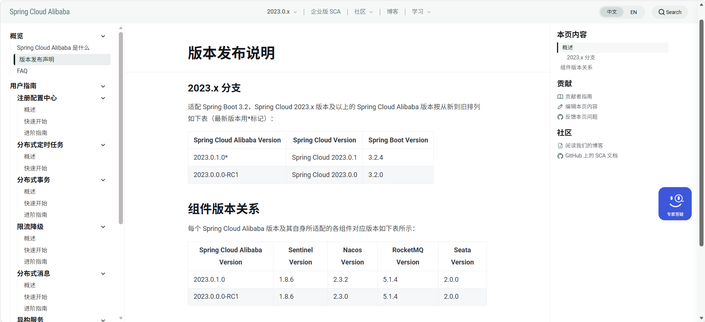

# 环境搭建
1. jdk版本使用8，使用17的话总是会报错且我找不到错处
2. spring-cloud 会有报错  
3. 接入spring-cloud-nacos报错 
4. 各个版本说明 
5. 搭建总结：1.多看官网 2.清idea缓存和maven内存 3.检查maven版本是否兼容，是否使用项目sdk？ 4.检查各个组件之间版本是否兼容
6. 遗留问题：1.启动会报错jackson 2.启动很慢，要经过maven compile等 3.启动服务后为什么总是不展示服务号?
# 分库分表
1. 分库分表介绍、场景。
2. 分库分表如何操作？
3. 分库分表性能如何评估？
4. 分库分表工具介绍、底层原理
5. shardingJDBC的归并
6. shardingJDBC实战（配合业务）