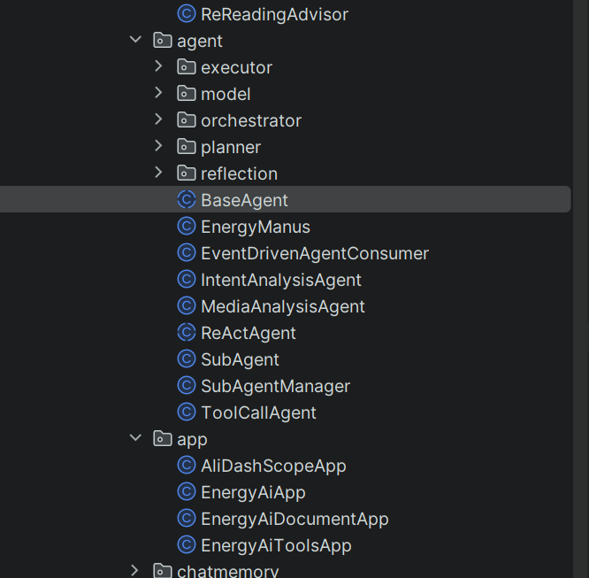
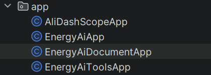
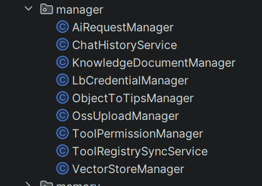
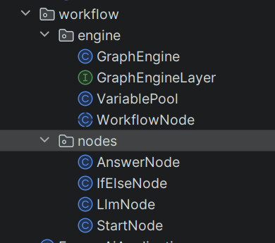

# 项目解读

## 工程模块设计
````
base-ai-assistant/
├── energy-admin-api/          # 管理后台（知识库管理、配置管理等）
├── energy-ai-api/             # 核心服务（RAG、Agent、MCP 实现）
├── energy-ai-mcp/             # MCP 服务定义
├── energy-ai-repository/      # 数据持久化（MySQL、PGVector）
├── ces-ai-rpc/                # RPC 接口定义（Dubbo/Feign，兼容 JDK 1.8）
├── service-common/            # 通用服务（配置、工具类）
└── service-domain/            # 领域模型定义
````
以上项目架构可以分析出，energy-ai-api、energy-admin-api是项目核心模块，其他模块则是围绕这两个服务而产生。


## energy-ai-api


### controller


#### AiController
1.AiController（/api/energy-ai）核心：返回各种格式的对话接口。
2.同步对话接口（/chat/sync）逻辑：
    2.1 加载最近的 N 轮"已完成"对话历史。
    2.2 处理媒体类型，插入数据库，同时使用拦截器记录。
    2.3 发送回复
3.流式对话接口（/chat/sse）逻辑：
    3.1 加载最近的 N 轮"已完成"对话历史。
    3.2 发送流式回复，doOnNext拼接并流式回复每轮结果、doOnComplete获取最后回复结果插入数据库。
4.sse接口（/chat/server_sent_event）逻辑：将流式对话结果构造成ServerSentEvent格式的返回体。
5.sseEmitter接口（/chat/sse_emitter）逻辑：sseEmitter在mvc中可以实现流式发送信息的效果。
6.rag接口（/chat/rag）逻辑：
    6.1 参数转换（批量解析用户上传的多媒体附件（如图片、PDF、语音等），并将它们统一转换为带标签的文本描述。）
    6.2 路由分发（analyzeIntent），通过用户的输入进行意图判别，判断用户问题属于什么业务领域。
    6.3 处理用户提问的文本和多媒体数据（generatePromptUserSpecConsumer）
    6.4 发送回复消息
7.其他接口（如/chat/report、/chat/tools、/chat/mcp）逻辑:在client中添加参数，如system、tools、mcp等。

#### AiToolController
1. AiToolController（/api/energy-ai/tool）核心：调用其他ai平台的接口。

#### CommandController
1. CommandController（/api/command）核心：接收用户的指令。
2. 执行接口（/execute）逻辑：替换对应的命令，并传入ai的prompt中。

#### DocumentController
1. DocumentController（/api/energy-ai/document）核心：向量库管理。
2. refreshDocumentVector（/document/refresh）: 同步刷新书库文档内容到向量库。
    2.1 分块文档
    2.2 增强文档内容

#### AdminApiController
1. AdminApiController（/api/admin）核心：管理后台接口。

#### ScopeToolConfigController
1. ScopeToolConfigController（/api/scope_tool_config）核心：权限配置解耦接口。

### agent

1. 由于项目中有多场景agent：如综合问答的agent、意向分析agent、图片分析agent、质量反馈agent reflection等等，所以需要封装agent（设计多agent可以更好的减少幻觉）
2. 遵照agent设计范式（reAct、plan and execute、reflection、可能还有reflexion），因此采用abstract的方式继承

#### BaseAgent
##### run
封装通用agent,定义通用执行流程:
1.对话状态管理 （防止同时调用多个agent等）
2.对话上下文管理 （保存上下文，方便交互时调用）
3.步骤控制（防止对话步骤过长）
4.异常处理
5.通用资源清理

##### runStream
SseEmitter SpringBoot中最简单的实现流式输出的api。
为了在界面中实现类似打字机般的效果，后端需要使用Flux与SSE技术。
Flux: 以**异步数据流**的形式封装数据，支持边输出边生成的场景。
SSE：客户端基于**http长连接**，向服务端发送连接，连接后服务端可持续向客户端发送数据，实现**实时高效传输**的效果。
流程：用户输入prompt-> 后端利用Flux实现边生成边输出的效果 -> SSE将服务端与客户端进行连接，服务端发送数据 -> 前端直接展示数据，无需等待。

#### ReActAgent

#### PlanAndExecuteAgent

#### ReflectionAgent

### app

封装底层chatClient，提供给controller或者manager使用

### manager

封装controller代码逻辑，提高复用能力

### workflow

工作流编排

### 其他
其他如guardrail、rag、skill、tool等都很常见

## energy-admin-api
后台管理api模块

## energy-ai-mcp
对mcp创建配置以及设置具体mcp