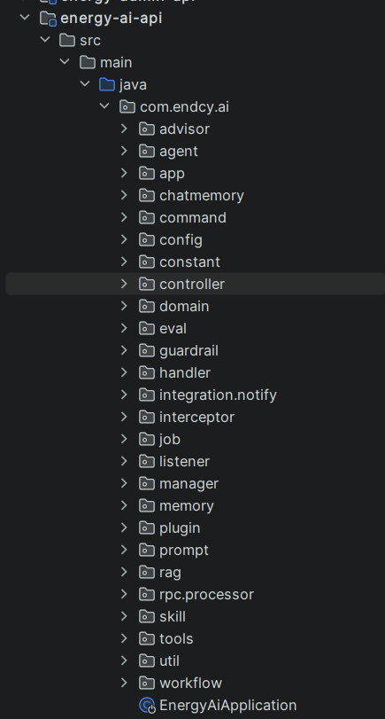
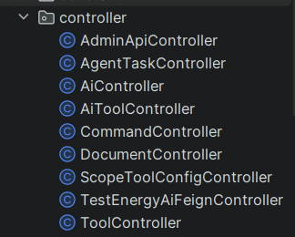

# 项目解读

## 工程模块设计
````
base-ai-assistant/
├── energy-admin-api/          # 管理后台（知识库管理、配置管理等）
├── energy-ai-api/             # 核心服务（RAG、Agent、MCP 实现）
├── energy-ai-mcp/             # MCP 服务定义
├── energy-ai-repository/      # 数据持久化（MySQL、PGVector）
├── ces-ai-rpc/                # RPC 接口定义（Dubbo/Feign，兼容 JDK 1.8）
├── service-common/            # 通用服务（配置、工具类）
└── service-domain/            # 领域模型定义
````
以上项目架构可以分析出，energy-ai-api、energy-admin-api是项目核心模块，其他模块则是围绕这两个服务而产生。


## energy-ai-api


### controller


1.AiController包含了同步对话和流式对话接口

## energy-admin-api