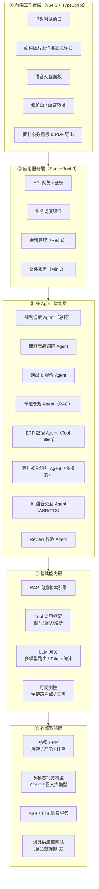
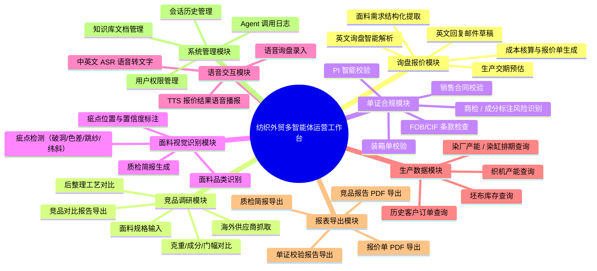
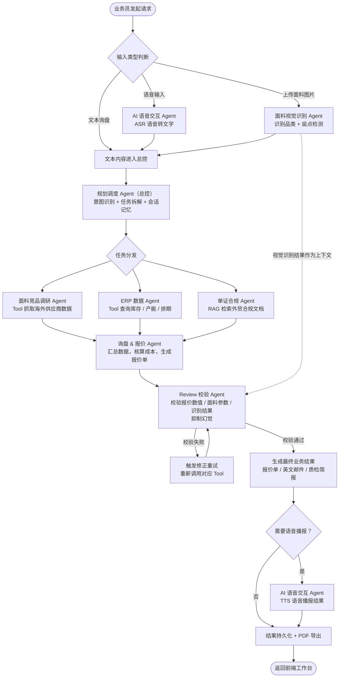

# 纺织外贸跨境多智能体运营工作台 — 概要设计文档

> 版本：v1.0
> 文档类型：概要设计（HLD）
> 技术栈：SpringBoot 3 / Maven 多模块 / Spring AI / RAG 向量库 / 多模态图像识别 / ASR+TTS / MySQL / Redis / MinIO / Vue 3

---

## 1. 项目概述

### 1.1 项目背景

本项目面向牛仔面料 B2B 外贸业务场景，基于企业现有纺织 ERP 系统，扩展多智能体（Multi-Agent）AI 能力，构建一套面向外贸业务员、外贸运营人员的智能运营工作台。

项目不替换原有 ERP，而是在其之上叠加 AI 智能层：通过自然语言、语音、图片等多模态输入方式，让业务员无需在多个系统间切换，即可完成询盘解析、成本报价、竞品调研、单证合规校验、生产交期预估等一系列外贸业务动作。

### 1.2 业务痛点

1. **询盘处理效率低**：海外客户英文邮件/WhatsApp 询盘格式不统一，业务员需手动解析面料规格、数量、交期，再分别登录 ERP 查库存、查产能、算成本，单条询盘处理耗时长。
2. **竞品调研成本高**：海外供应商网站分散，牛仔面料克重、成分、门幅、后整理工艺等参数需人工逐个比对，难以快速输出竞品对比报告。
3. **单证合规风险高**：PI、销售合同、装箱单涉及 FOB/CIF 贸易条款、商检要求、面料成分标注规范，人工校验容易遗漏风险点。
4. **交期预估依赖经验**：坯布库存、染缸排期分散在不同系统，新人难以快速判断可承诺交期。
5. **面料实物核验依赖肉眼**：客户寄样或现场拍照后，面料品类识别、疵点检测仍需人工，效率低且标准不统一。

### 1.3 项目目标

- 构建一套**多 Agent 协同**的外贸运营工作台，将询盘处理、报价、竞品调研、单证校验、交期预估串成自动化工作流。
- 融合**多模态能力**：支持面料图片识别（品类 + 疵点检测）、ASR/TTS 中英文语音交互。
- 通过 **Tool Calling** 对接现有纺织 ERP，实现坯布库存、染厂产能、历史订单等真实业务数据查询。
- 通过 **RAG 知识库** 沉淀外贸合规文档、工艺标准，使回答可溯源、可审计。
- 引入 **Review 校验 Agent** 抑制 AI 幻觉，保证报价、克重、交期等关键业务数值可信。

---

## 2. 系统分层架构图

### 架构说明

系统自上而下分为五层：

- **前端工作台层**：基于 Vue 3 的单页应用，承载多模态交互入口，包括对话、图片上传、语音面板、单据预览与导出。
- **应用服务层**：SpringBoot 提供 RESTful / WebSocket 接口，负责鉴权、会话管理（Redis）、文件存取（MinIO），是前端与智能层之间的业务网关。
- **多 Agent 智能层**：项目核心。8 个 Agent 各司其职，由规划调度 Agent 统一编排；Agent 之间通过消息总线协作，结果统一经过 Review Agent 校验后再返回前端。
- **基础能力层**：与具体业务解耦的通用 AI 能力，包括 RAG 检索、Tool 调用框架、LLM 网关、可观测性，可被任意 Agent 复用。
- **外部系统层**：对接企业现有纺织 ERP、多模态视觉模型、ASR/TTS 语音服务、海外供应商网站，是真实业务数据与外部能力的来源。

---

## 3. 系统功能模块结构图

### 功能说明

系统功能按业务领域划分为八大模块：

- **询盘报价模块**：核心主链路，从英文询盘解析到成本核算、报价单生成、交期预估，是外贸业务员最高频使用的能力。
- **竞品调研模块**：输入面料规格后自动抓取海外供应商数据，输出横向对比表，辅助定价决策。
- **单证合规模块**：基于 RAG 知识库校验 PI、合同、装箱单，识别贸易条款、商检、成分标注等风险点。
- **面料视觉识别模块**：多模态能力入口，上传面料照片即可识别品类与疵点，输出带标注的质检简报。
- **语音交互模块**：ASR 将业务员语音转为文本驱动 Agent；TTS 将报价结果播报出来，支持中英文，方便车间/外勤场景。
- **生产数据模块**：通过 Tool Calling 对接纺织 ERP，查询库存、产能、排期、历史订单，是报价与交期预估的数据基础。
- **报表导出模块**：所有业务结果（报价单、竞品报告、质检简报、单证校验报告）均支持 PDF 导出，用于归档与客户发送。
- **系统管理模块**：知识库文档维护、用户权限、Agent 调用日志、会话历史，支撑企业内部使用与审计。

---

## 4. 多 Agent 业务流程图

### 流程说明

完整询盘业务主流程覆盖三种输入入口：

1. **文本询盘**：业务员直接粘贴英文邮件或文字描述，进入总控 Agent。
2. **语音询盘**：语音先经 AI 语音交互 Agent 做 ASR 转写，再进入总控。
3. **图片询盘**：面料照片先经面料视觉识别 Agent 识别品类与疵点，识别结果作为上下文进入总控。

总控 Agent 完成意图识别与任务拆解后，**并行调度**三个子 Agent：

- 面料竞品调研 Agent 通过 Tool 抓取海外供应商数据；
- ERP 数据 Agent 通过 Tool 查询库存、产能、排期；
- 单证合规 Agent 通过 RAG 检索外贸合规文档。

三路结果汇总后，由**询盘 & 报价 Agent** 统一核算成本、生成报价单与英文邮件草稿。随后进入 **Review 校验 Agent**，对报价数值、面料参数、视觉识别结果做一致性校验；若校验失败则触发修正重试，重新调用对应 Tool。校验通过后生成最终业务结果，按需走 TTS 语音播报，最后持久化并导出 PDF，返回前端工作台。

---

## 5. 数据存储简要说明

| 存储介质 | 用途 | 存储内容 |
|---|---|---|
| **MySQL** | 业务结构化数据 | 询盘记录、报价单、客户档案、订单快照、用户与权限、Agent 调用日志 |
| **Redis** | 会话与缓存 | 短期会话记忆、Agent 任务中间态、Tool 调用结果缓存、分布式锁 |
| **向量库（Milvus）** | RAG 知识库 | 外贸报关资料、FOB/CIF 条款、面料质检标准、牛仔工艺 SOP、PI/合同模板等文档的向量索引 |
| **MinIO** | 文件对象存储 | 面料原图、疵点标注图、导出的 PDF 报价单/报告、上传的 PI/合同原件 |

> 说明：向量库仅存储文档分片及其向量，不存业务结构化数据；业务数据仍以 MySQL 为准，保证一致性与事务能力。

---

## 6. 非功能需求

### 6.1 性能需求

- 单次询盘处理（含多 Agent 调度 + Tool 调用 + RAG 检索）端到端响应时间 ≤ 8 秒；流式输出下首字响应 ≤ 2 秒。
- 面料图片视觉识别单张推理 ≤ 3 秒；ASR 实时转写延迟 ≤ 1.5 秒。
- 支持 50 并发业务员同时使用，会话级任务队列异步处理长链路任务。

### 6.2 安全需求

- 用户与权限隔离：外贸业务员、运营、管理员分级授权，业务员仅可见本人询盘与报价数据。
- 数据脱敏：报价单、成本数据在日志与导出文件中按角色脱敏展示。
- Prompt 注入检测：对用户输入做注入检测，防止越权调用 Tool 或诱导输出敏感数据。
- 操作审计：记录谁在何时发起询盘、调用了哪些 Tool、导出了哪份文档，支持审计追溯。

### 6.3 可扩展性

- **Agent 可插拔**：新增业务 Agent 只需实现统一 Agent 接口并注册，无需改动总控调度逻辑。
- **Tool 可扩展**：Tool 调用框架支持新增 ERP 接口、外部网站抓取器，具备超时、重试、熔断能力。
- **知识库可热更新**：RAG 支持文档增量入库与下线，无需重启服务。
- **模型可替换**：LLM 网关抽象多模型路由，支持在不同模型间切换而不影响业务代码。

### 6.4 AI 幻觉治理

- **Review 校验 Agent**：所有业务数值（报价、克重、交期、库存数）必须来自 Tool 返回的真实数据，由 Review Agent 交叉校验；与 Tool 数据冲突的结论直接判定为幻觉并重试。
- **RAG 溯源**：单证合规类回答必须附带引用文档出处，无来源则不予输出。
- **置信度阈值**：面料视觉识别结果置信度低于阈值时，标记为"待人工复核"，不直接作为报价依据。
- **工具优先**：业务查询类问题强制走 Tool Calling，禁止 LLM 凭记忆编造 ERP 数据。

---

## 附：文档配套说明

- 本文档为概要设计（HLD），聚焦架构、模块划分与业务流程，不含具体代码实现。
- 所有 Mermaid 图可直接粘贴至 Typora、Mermaid Live Editor（https://mermaid.live）或支持 Mermaid 的 Markdown 编辑器中渲染，并截图嵌入正式设计文档。
- 后续详细设计将基于本文档展开，包括各 Agent 的输入输出契约、Tool 接口定义、数据库 ER 设计与 RAG 分块策略。
